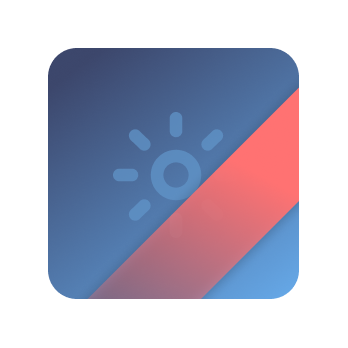

# Launch Icon Badge

## Install

Available on [Visual Studio Marketplace]()

## Features

## Tutorial
You will find a complete tutorial here:

##### English version :
[https://damienaicheh.github.io/azure/devops/2020/01/09/easily-differentiate-versions-of-your-applications-using-azure-devops-en](https://damienaicheh.github.io/azure/devops/2020/01/09/easily-differentiate-versions-of-your-applications-using-azure-devops-en)

##### French version :
[https://damienaicheh.github.io/azure/devops/2020/01/09/easily-differentiate-versions-of-your-applications-using-azure-devops-fr](https://damienaicheh.github.io/azure/devops/2020/01/09/easily-differentiate-versions-of-your-applications-using-azure-devops-fr)

## Example of variable export for developing the project on a Mac:

```
export INPUT_SourceFolder="./../IconsSamples" &&
export INPUT_Contents="**/*1024@1x.png" &&
export INPUT_BannerVersionNamePosition="bottomRight" &&
export INPUT_BannerVersionNumberPosition="top" &&
export INPUT_BannerVersionNameText="prerelease" &&
export INPUT_BannerVersionNameColor="#E5A3FF" &&
export INPUT_BannerVersionNameTextColor="#FFFF00" &&
export INPUT_BannerVersionNumberTextColor="#FFFFFF" &&
export INPUT_BannerVersionNumberText="98.34.56" &&
export INPUT_BannerVersionNumberColor="#34424F"
```